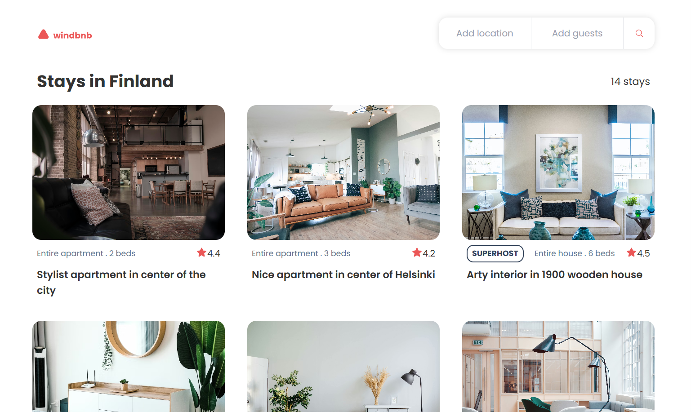

# windbnb Project [Link](https://www.example.com)

Final project for Funval Front-end web development level 1

## Description

A more detailed description of the project, what it solves, and its key features.

## Changes

- Implemented a fourth column when the screen size is 2xl (>1536px)
- Included the description "Edit Your Search" and the close button in tablet and desktop layouts
- Title updates with City and guest number
- When the search option is incomplete, but only corresponds to one city, that city is shown in the title
- When two cities are possible, both are shown in the title
- When "Finland" is searched, all stays are shown

## Screenshot

